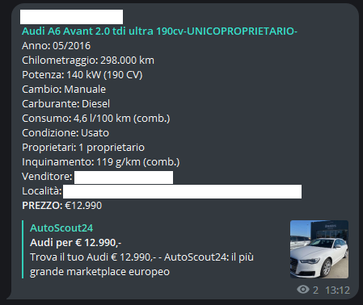

# Autoscout24 Telegram Bot
Telegram bot for autoscout24 written in Python which scrapes (for research purposes) all the new listings from a specific search and sends them to a Telegram chat or channel. It's compatible with all autoscout24 websites aside from the swiss one with the new layout.

## Example message

## How to use
- Install requirements
- Create a .env file in the project root and add the variables:
    - URL = go on your favorite autoscout portal, make the search you are interested in, copy here the URL from the browser
    - WAIT_BEFORE_NEXT = seconds to wait before the next search (default is 120)
    - API_TOKEN = your Telegram API token for the bot
    - CHAT_ID = the ID of the chat/channel you want to send the messages to. To find the id, simply send a message in the chat/channel and forward it to https://t.me/JsonDumpBot. In the response you will find the chat ID
- Run the main.py

## To do
[ ] Add logging levels instead of printing everything